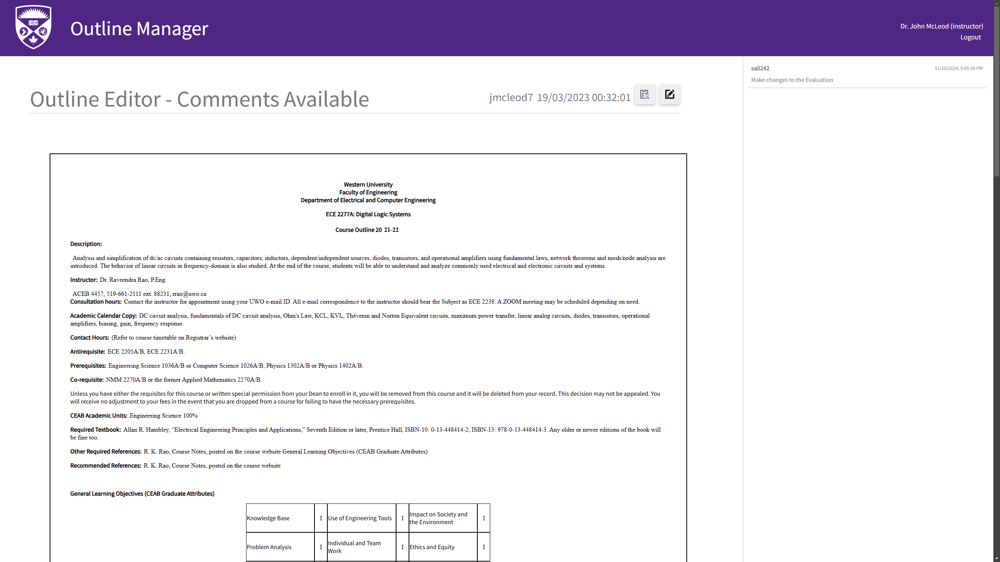
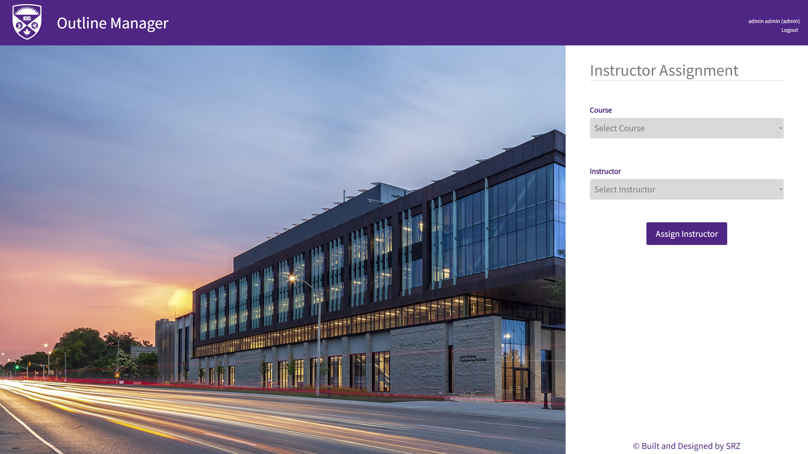
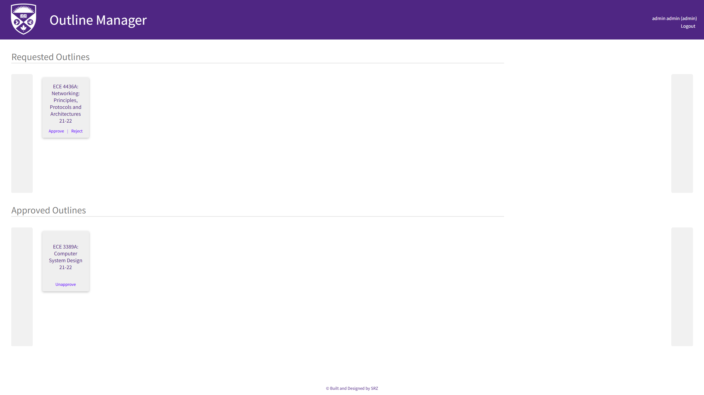
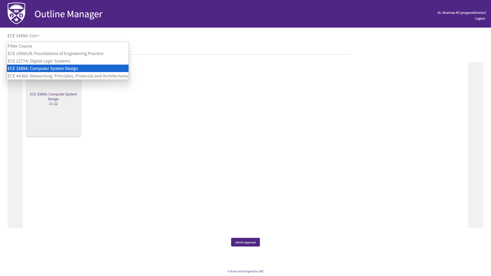
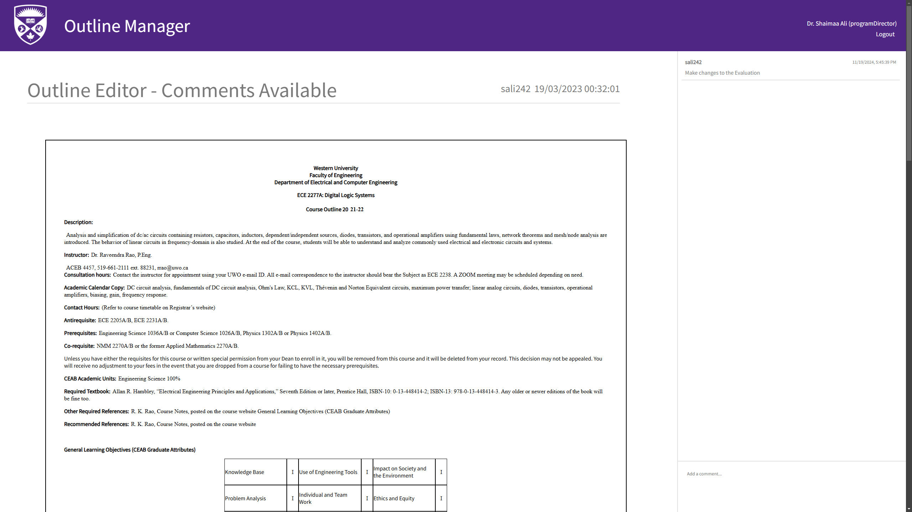
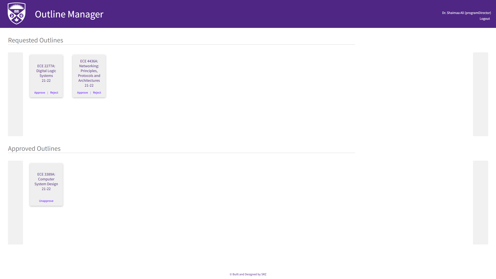

# CourseFlow

## Description

CourseFlow is a web-based application to automate the creation, editing, approval, and tracking of course outlines in the ECE department at Western University. It provides role-based functionalities for instructors and administrators to streamline the process while ensuring compliance with departmental templates and guidelines.


## Features

- **Instructor View**:

  - Create, edit, and view course outlines.
  - Link learning objectives to graduate attribute (GA) indicators.
  - Add assessment methods for GA indicators (displayed on the web but not included in PDFs).
  - Access previous outline versions and details of pre-requisites or anti-requisites.
  - Track changes with timestamps and user IDs.
  - Generate PDF versions of course outlines.

- **Admin View**:

  - Assign instructors to courses.
  - Review and approve/unapprove outlines.
  - Provide feedback and comments for revisions.
  - View history and change logs for any course outline.

- **Program Director View**:

  - View all course outlines under their program.
  - Review and approve/unapprove outlines.
  - Provide feedback and comments for revisions.
  - View history and change logs for any course outline.

- **General Features**:
  - Compliance with department-specific templates.
  - PDF export for finalized course outlines.
  - Role-based access control.

## Technologies Used

- **Frontend**: React.js (located in the `client/` directory)
- **Backend**: Node.js with Express (located in the `server/` directory)
- **Database**: MongoDB for storing outlines, user data, and version history
- **PDF Generation**: A library for creating PDFs from course outline data
- **Environment Management**: `.env` files for configuration

## Installation and Setup

### Prerequisites

- Node.js (v14 or later)
- MongoDB

### Steps

1. Clone the repository:
   ```bash
   git clone <repository_url>
   cd CourseFlow
   ```
2. Set up the frontend:
   ```bash
   cd client
   npm install
   npm start
   ```
3. Set up the frontend:
   ```bash
   cd client
   npm install
   nodemon server
   ```
4. Setup the Database
   - Ensure you have Mongoose downloaded
   - Start database
   - Run command
   ```bash
   mongosh
   ```

# Screenshots

### **Instructor View:**




### **Admin View**:





### **Program Director View**:





